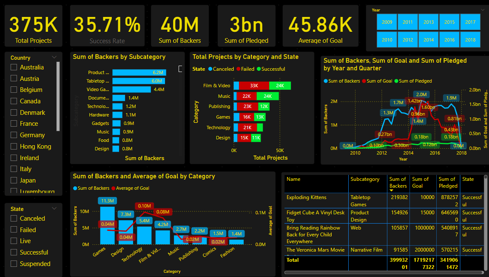

# 🎬 Media Campaign Analytics with SQL & Power BI

This project analyzes over 375,000 media crowdfunding campaigns (Kickstarter-style) using SQL for data cleaning and analysis, and Power BI for interactive dashboard visualization.

---

## 📌 Overview

This end-to-end project focuses on understanding trends and success patterns in media-related crowdfunding projects. Starting from a raw CSV, the project walks through data ingestion, cleaning, transformation, exploration, and finally insight-driven reporting via Power BI.

---

## 🛠 Tools & Technologies
- **SQL Server** – Data ingestion, cleaning, transformation, and analysis
- **Power BI** – Dashboard and data visualization
- **CSV Data** – Input file (~375,000 records)

---

## 🔍 Key Objectives

- Load raw media crowdfunding data into SQL Server
- Clean and convert inconsistent datatypes (e.g., dates, integers)
- Analyze:
  - Project success rate by category, subcategory, and country
  - Backer behavior
  - Campaign funding goals vs. pledged amounts
  - Time-based trends (monthly/quarterly/yearly)
- Build a Power BI dashboard with filters and KPI cards

---

## 🧠 SQL Analysis Highlights

- Used `BULK INSERT` to load CSV data
- Applied data cleaning using `ALTER`, `CONVERT`, and `CAST` functions
- Extracted `Launch_Timing`, and separated `DATE` & `TIME` from combined datetime fields
- Applied advanced SQL techniques:
  - Window Functions: `RANK()`, `NTILE()`, `ROW_NUMBER()`
  - Conditional Aggregation using `CASE WHEN`
  - Time-series grouping (Year, Quarter, Month)
- Performed success ratio analysis by `GoalRange`, Category, and Country

---

## 📊 Power BI Dashboard

The dashboard includes:
- Total projects launched
- Success/failure breakdown by category and year
- Pledged amount analysis by subcategory
- Country-wise funding comparison
- Backers’ contribution insights
- Filters: Year, Country, Category, Project State

📸 **Dashboard Preview:**

---

## 📈 Key Insights

- 💰 **Highest Backed Subcategories:** Product Design, Tabletop Games, and Video Games
- 🗺️ **Top Countries:** United States leads both in total pledged and in failed projects
- 🎯 **Goal Range vs. Success:** Projects with smaller goals have higher success rates
- 📆 **Year-over-Year Trends:** Project launches peaked around certain years; success rates vary seasonally

---

## 📁 Repository Contents

---

## 🔗 Useful Links

- 📄 [SQL Code](MediaP.sql)
- 🌐 [My Portfolio](https://datascienceportfol.io/muhammedshabnaspa)
- 💼 [My GitHub](https://github.com/Muhammed-Shabnas-PA)

---

## 📬 Contact

**Muhammed Shabnas P A**  
📧 Email: muhammedshabnaspa@gmail.com  
🔗 GitHub: [@Muhammed-Shabnas-PA](https://github.com/Muhammed-Shabnas-PA)

---

